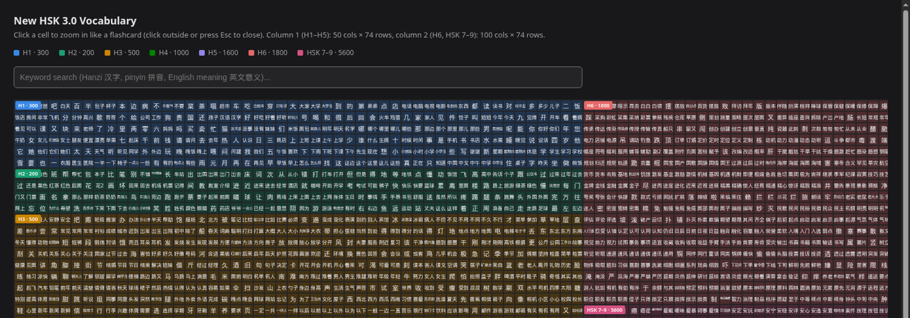

# HSK Vocabulary Mosaic

An interactive study page for the New HSK 3.0 vocabulary (levels 1–7-9,
~11,000 words): every word is a colored cell in a mosaic, sized and grouped
by HSK level. Click a cell to flip it into a flashcard with pinyin, part of
speech, translation, and pronunciation audio.



**[Live demo](https://nguyenlog205.github.io/self-chinese-hsk-vocabulary/)**
(GitHub Pages)

## Why

Existing HSK word-list apps are either paywalled, ad-heavy, or split the
vocabulary across dozens of pages. This project parses the official
MandarinBean PDF word lists once into clean CSVs, then serves the entire
HSK 1–9 vocabulary as one page that loads and renders it client-side.

## Features

- **11,000 words, one page** — all seven HSK levels rendered as a single
  scrollable mosaic, color-coded by level.
- **Flashcard on click** — word, pinyin, part of speech, and translation in
  an overlay card.
- **Pronunciation audio** — pre-recorded MP3 per word, with a Web Speech API
  fallback if a clip is missing.
- **Live search** — filter by hanzi, accented or unaccented pinyin, or
  English meaning as you type.
- **Light/dark aware** — follows the OS theme automatically.
- **No backend** — plain static files; `assets/app.js` fetches the CSVs and
  renders the mosaic entirely in the browser.

## How it's built

```
data/pdf/*.pdf  →  src/pdf_to_csv.py  →  vocab/*.csv  →  assets/app.js (fetch, in-browser)  →  rendered page
(source PDFs)                            (clean data)     + audio/*.mp3
```

1. **`src/pdf_to_csv.py`** parses the MandarinBean "New HSK Vocabulary" PDFs
   (run once, offline). Their tables aren't ruled on every row, so
   pdfplumber's line-based table detector misses most rows; this script
   instead clusters words by x/y position, infers columns from the header
   row, and stitches translation or POS text that wraps onto a second line
   back into its entry. It also fixes a font quirk where some hanzi are
   encoded as CJK *radical* code points instead of the real character (e.g.
   `⼋` U+2F0B vs `八` U+516B) by normalizing to NFKC.
2. **`vocab/*.csv`** — one clean `Word,Pinyin,POS,Translation` file per
   level, plus `hsk_table.csv` mapping every word to its level. This is the
   only data the page depends on at runtime.
3. **`assets/app.js`** fetches each level's CSV, parses it, and renders one
   CSS-grid "block" per level sized to its word count — matching each row up
   with its `audio/<level>/NNNN.mp3` clip — then pads the shorter of the two
   columns (H1–H5 vs H6/HSK 7-9) with blank rows so both line up.

Because the page fetches its data, it needs to be served over http(s) — it
won't load correctly if you just double-click `index.html` (browsers block
`fetch()` on `file://`). Use GitHub Pages, or for local development:

```bash
python -m http.server
# then open http://localhost:8000
```

## Project structure

```
data/pdf/       source PDFs (MandarinBean "New HSK Vocabulary")
vocab/*.csv     parsed word lists, one per level + a combined level lookup
audio/H*/       pronunciation clips, one MP3 per word, matched by index
src/            pdf_to_csv.py — the offline PDF -> CSV parser
assets/         style.css + app.js, loaded by index.html
index.html      the static page shell
```

## Regenerating the vocab CSVs

Only needed if you replace the source PDFs in `data/pdf/`:

```bash
pip install -r requirements.txt
python src/pdf_to_csv.py -i data/pdf -o vocab --mode dir
```

## Data source

Vocabulary text is adapted from the free "New HSK Vocabulary" PDF lists
published by [MandarinBean.com](https://mandarinbean.com), included here for
personal, non-commercial study. See [`LICENSE`](LICENSE) for the code's
license and data attribution note.
